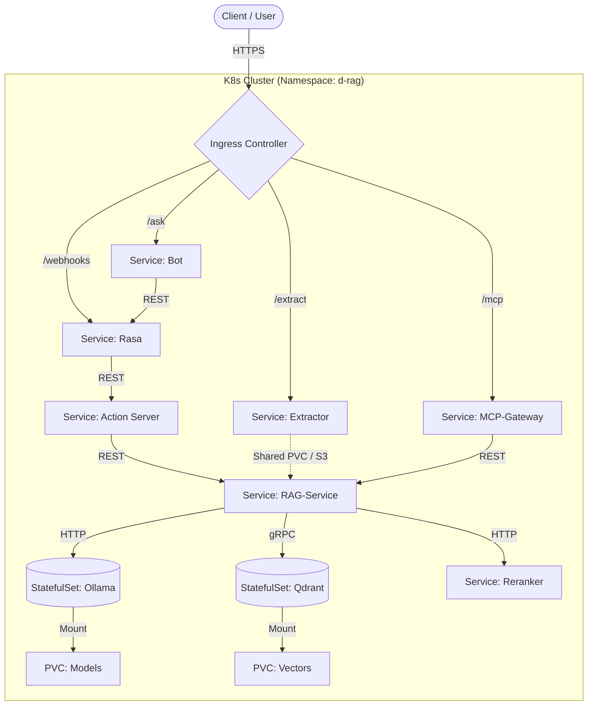

# Kubernetes Deployment Design (Hybrid: Helm + Kustomize)

Dieses Dokument beschreibt die Architektur für die Migration des Docker-Compose-Stacks auf Kubernetes (v1.29+). Es verfolgt einen hybriden Ansatz: **Helm** für Standard-Infrastruktur und **Kustomize** für die Applikationslogik.

## 1. Architektur-Übersicht

Das System besteht aus Stateless-Microservices (Bot, Rasa, RAG) und Stateful-Komponenten (Qdrant, Ollama).



## 2. Deployment-Strategie

Wir trennen "Commodity Software" (Helm) von "Business Logic" (Kustomize).

### Komponenten-Matrix

| Komponente | Tool | Typ | Begründung |
| :--- | :--- | :--- | :--- |
| **Qdrant** | Helm | StatefulSet | Nutzung des offiziellen Charts (`qdrant/qdrant`) für Wartbarkeit und HA-Optionen. |
| **Monitoring** | Helm | Operator | `kube-prometheus-stack` für Prometheus/Grafana + ServiceMonitors. |
| **Ingress** | Helm | DaemonSet | `ingress-nginx` als Standard-Controller. |
| **Ollama** | Kustomize | StatefulSet | Maßgeschneidertes Manifest nötig für GPU-Resources (`nvidia.com/gpu`) und Model-Caching Strategien. |
| **Apps** | Kustomize | Deployment | `bot`, `rasa`, `action-server`, `rag`, `extractor`, `mcp`, `reranker`. Ermöglicht einfache Overlays (Dev/Prod) ohne Chart-Overhead. |

### Alternativen
*   **Reines Helm:** Hoher Boilerplate-Aufwand für eigene Microservices.
*   **Operatoren:** Für Rasa X/Pro existieren Operatoren, für Rasa Open Source ist der Deployment-Ansatz flexibler.
*   **Deployment:** GitOps via **ArgoCD** oder **Flux** wird empfohlen, ist aber optional. Start via `kubectl apply`.

## 3. Ordnerstruktur & Beispiele

Die Struktur trennt Basis-Definitionen von umgebungsspezifischen Anpassungen (Overlays).

```text
k8s/
├── base/                        # "Plain YAML" Definitionen
│   ├── apps/
│   │   ├── rasa/                # deployment.yaml, service.yaml (Port 5005)
│   │   ├── action-server/       # deployment.yaml (Ports 5055, 8001)
│   │   ├── rag-service/         # deployment.yaml (Port 8000)
│   │   ├── reranker/            # deployment.yaml
│   │   └── ... (bot, extractor, mcp)
│   ├── infra/
│   │   └── ollama/              # statefulset.yaml (GPU requests)
│   └── kustomization.yaml       # Referenziert alle Unterordner
│
├── overlays/
│   ├── dev/                     # Lokale Entwicklung (Kind/Minikube)
│   │   ├── kustomization.yaml   # Patches für Replicas=1, Insecure Flags
│   │   └── map-config.yaml      # Dev-ConfigMapGenerator
│   └── prod/                    # Produktion
│       ├── kustomization.yaml   # Replicas>1, Resource Quotas
│       └── patches-storage.yaml # NFS/S3 Konfiguration
│
└── helm/                        # Values-Dateien für externe Charts
    ├── qdrant-values.yaml
    └── prometheus-values.yaml
```

### Konkretes Kustomize-Beispiel

**`base/apps/rag-service/deployment.yaml`**:
```yaml
apiVersion: apps/v1
kind: Deployment
metadata:
  name: rag-service
spec:
  template:
    spec:
      containers:
      - name: app
        image: d-rag/rag-service:latest
        envFrom:
        - configMapRef:
            name: app-config
```

**`overlays/dev/kustomization.yaml`**:
```yaml
apiVersion: kustomize.config.k8s.io/v1beta1
kind: Kustomization
resources:
  - ../../base
namePrefix: dev-
namespace: d-rag-dev
patches:
  - target:
      kind: Deployment
      name: rag-service
    patch: |-
      - op: replace
        path: /spec/replicas
        value: 1
configMapGenerator:
  - name: app-config
    behavior: merge
    literals:
      - LOG_LEVEL=DEBUG
```

## 4. Speicher & Ressourcen

### Persistenz-Anforderungen
1.  **Vektor-DB (Qdrant):** `ReadWriteOnce` (RWO) PVC. Größe je nach Dokumentenmenge (Start: 10GB).
2.  **LLM-Cache (Ollama):** `ReadWriteOnce` (RWO) PVC für `~/.ollama`. Vermeidet Download von Modellen (~10GB+) bei jedem Pod-Neustart.
3.  **Shared Data (Extractor -> RAG):**
    *   *Dev:* `hostPath` oder einfacher PVC.
    *   *Prod:* **Empfehlung:** Umbau auf S3 (MinIO). **Fallback:** `ReadWriteMany` (RWX) via NFS.
4.  **Rasa Modelle:** Werden im Prod-Build idealerweise ins Image gebacken (`COPY models/ ...`), um Abhängigkeiten zur Laufzeit zu entfernen.

### Ressourcen-Kosten (Schätzung)
*   **CPU:** Rasa/Action-Server/Reranker benötigen signifikante CPU-Leistung für Inferenz, wenn keine GPU vorhanden ist.
*   **RAM:** Qdrant benötigt RAM für Indizes.
*   **GPU (Optional):** Für Ollama/Reranker dringend empfohlen (Nvidia T4/A10), um Latenzen < 2s zu erreichen. Ohne GPU sind Antwortzeiten von >30s möglich.

## 5. Netzwerk & Sicherheit

### Ingress Routing
Der Ingress-Controller terminiert TLS und routet basierend auf Pfaden:
*   `/webhooks/rest/webhook` -> `rasa:5005`
*   `/ask` -> `bot:3978`
*   `/extract` -> `extractor:8100`
*   `/mcp` -> `mcp:8800`

### Sicherheits-Härtung
*   **NetworkPolicies:** Standardmäßig *Deny-All*. Erlaube explizit:
    *   `bot` -> `rasa`
    *   `rasa` -> `action-server`
    *   `action-server`, `mcp`, `extractor` -> `rag-service`
    *   `rag-service` -> `qdrant`, `ollama`
*   **Pod Security:** Container sollten als `non-root` laufen (`runAsUser: 1000`). `securityContext.readOnlyRootFilesystem: true` wo möglich.

## 6. Observability

*   **Logging:** Zentralisiert via EFK-Stack oder Loki (optional). Standardmäßig `kubectl logs`.
*   `ServiceMonitor` (Prometheus CRD) für:
    *   `action-server` (Port 8001)
    *   `bot` (Port 9100)
    *   `reranker` (Port X, assuming it also exposes metrics)
*   **Tracing:** Deployment des **OTel-Collectors** als Sidecar oder Deployment, konfiguriert über ConfigMap, um Traces an Tempo/Jaeger zu senden.

## 7. Pre-Deployment Checkliste

Vor dem Apply auf einem Cluster:

1.  **Lokaler Test-Cluster:**
    ```bash
    kind create cluster --name d-rag-test
    ```
2.  **Images bereitstellen:**
    Images bauen und in den Cluster laden (oder Registry nutzen):
    ```bash
    docker build -t d-rag/bot:latest ./bot
    kind load docker-image d-rag/bot:latest --name d-rag-test
    # ... für alle Services wiederholen
    ```
3.  **Helm Dependencies:**
    ```bash
    helm repo add qdrant https://qdrant.github.io/qdrant-helm
    helm repo add prometheus-community https://prometheus-community.github.io/helm-charts
    helm repo add ingress-nginx https://kubernetes.github.io/ingress-nginx
    helm dependency build k8s/helm
    ```
4.  **Dry-Run:**
    ```bash
    kubectl kustomize k8s/overlays/dev | kubectl apply -f - --dry-run=client
    ```
6.  **Config prüfen:** Sind RAG-Endpoints, Qdrant-URL, Ollama-URL korrekt gesetzt? Environment-spezifische Secrets erstellt?
7.  **Liveness/Readiness Probes:** Sind Liveness- und Readiness-Probes für alle Deployments korrekt konfiguriert?
8.  **Ressourcen-Anfragen/-Limits:** Sind CPU/Memory Requests und Limits für alle Container definiert?
9.  **Ingress Domains:** DNS-Einträge für `/webhooks/rest/webhook`, `/ask`, `/extract`, `/mcp` zeigen auf den Ingress.
7.  **Security:** Secrets (API Keys, Tokens) via Kubernetes Secrets; NetworkPolicies angewendet.
8.  **Action-Server:** Service-Port 5055 für Rasa erreichbar; Metrics auf 8001 scrape-bar (ServiceMonitor). Modelle ins Image packen oder via PVC bereitstellen.
